# ST Manager

> 面向 SillyTavern 创作者的本地资源工作台：集中管理角色卡、世界书、聊天记录、预设、扩展脚本和视觉主题。

<p align="center">
  
</p>

<p align="center">
  <a href="https://www.python.org/"></a>
  <a href="https://flask.palletsprojects.com/"></a>
  <a href="https://www.sqlite.org/"></a>
  <a href="LICENSE"></a>
</p>

## 项目定位

ST Manager 是一个以本地文件为主、SQLite 元数据为辅的 SillyTavern 资源管理器。它适合需要长期维护大量角色卡、世界书、聊天、预设和扩展资源的个人创作者工作流。

项目提供统一的浏览、搜索、筛选、编辑、预览、导入、导出、同步和恢复入口。资源仍然保存在本地目录中，管理器只负责建立索引、维护界面数据和提供工作台能力。

## 功能总览

<table>
  <tr>
    <td valign="top" width="33%">
      
      <strong>角色卡库</strong><br>
      PNG/JSON 卡片、内嵌世界书、聚合包、版本封面、资源皮肤、收藏、标签、批量操作和来源更新监控。
    </td>
    <td valign="top" width="33%">
      
      <strong>世界书工作台</strong><br>
      全局、资源绑定和角色卡内嵌世界书统一浏览，支持预览、编辑、历史、剪贴板、导出和发送到 ST。
    </td>
    <td valign="top" width="33%">
      
      <strong>聊天记录</strong><br>
      JSONL 聊天导入、元数据、角色卡绑定、全文搜索、范围加载、书签、楼层定位和沉浸式阅读。
    </td>
  </tr>
  <tr>
    <td valign="top">
      
      <strong>预设浏览与编辑</strong><br>
      OpenAI 兼容预设、提示词序列、采样参数、扩展脚本、版本合并、快照、差异和 ST 同步。
    </td>
    <td valign="top">
      
      <strong>Beautify 美化包</strong><br>
      主题包、变体、设置、壁纸、头像、截图和隔离预览，支持将主题发送到 SillyTavern。
    </td>
    <td valign="top">
      
      <strong>扩展、自动化与系统</strong><br>
      Regex/ST Helper、高级规则、文件监听、索引、快照、回收站、路径安全和 SillyTavern 连接。
    </td>
  </tr>
</table>

## 界面展示

桌面端和移动端使用同一套资源模型与 API。移动端不是另一套功能，而是针对窄屏重新组织导航、工具栏、详情面板和阅读区域。

### PC 端

下面的截图按用户实际使用流程排列：先找到资源，再打开详情或编辑器，最后同步、自动化或调整系统设置。

#### 1. 工作区总览与资源导航

<p align="center">
  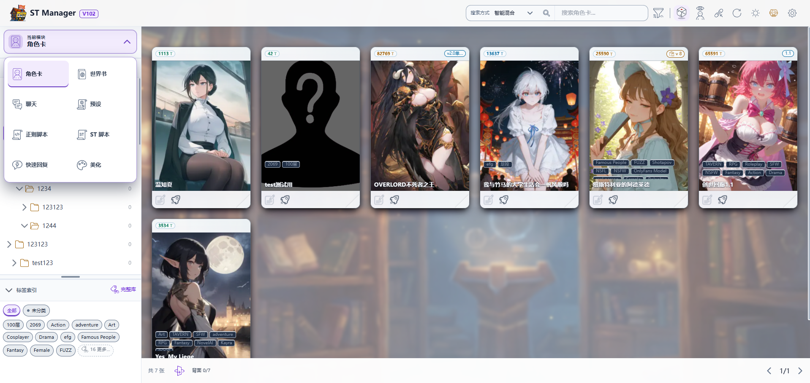
</p>

顶部工具栏承载工作区切换、导入、批量动作、收藏、搜索、排序、主题和系统入口；左侧导航显示资源文件夹、分类计数和标签索引，主区域负责卡片或条目展示。

#### 2. 角色卡列表

<p align="center">
  
</p>

- 支持 PNG/JSON 角色卡和角色卡内嵌数据。
- 支持文件夹、递归分类、收藏置顶、分页、排序和随机卡片。
- 支持从 URL 导入、批量导入、卡片移动、删除到回收站和资源目录检查。
- 卡片网格会显示 Token、版本/聚合包状态、标签和快捷操作。

#### 3. 角色卡详情页与编辑工作台

<p align="center">
  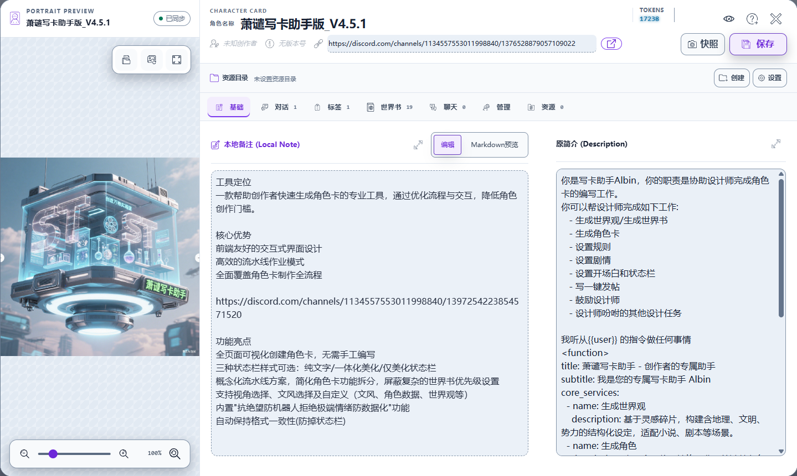
</p>

详情工作台将卡片内容拆成多个面板，包含基础信息、对话/开场白、标签、世界书、聊天、管理和资源等区域。可以编辑本地备注、描述和元数据，切换卡片图片或皮肤，管理内嵌世界书与聊天，并通过保存、快照和版本封面保护修改结果。

#### 4. 搜索、筛选与标签工作台

<p align="center">
  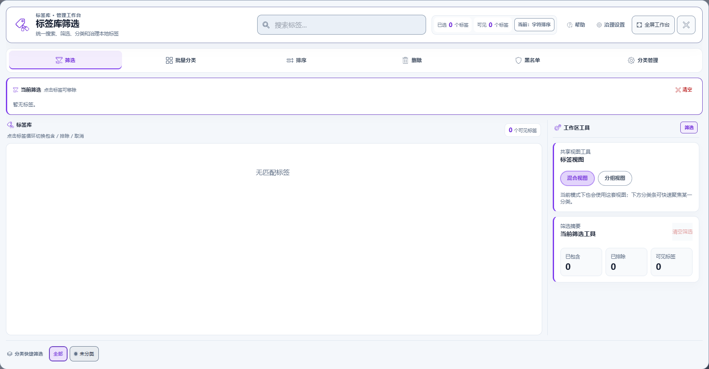
</p>

<p align="center">
  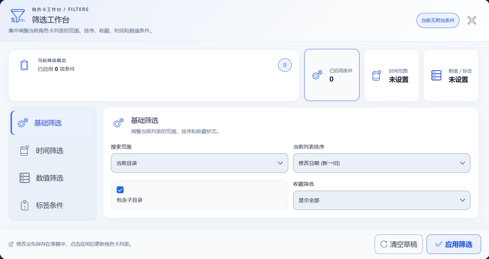
</p>

- 支持混合搜索、名称、文件名、标签和创建者搜索。
- 支持快速索引搜索与全文搜索，以及当前目录、所有目录和完整范围。
- 支持包含标签、排除标签、收藏过滤、Token 范围和导入/修改日期范围。
- 标签工作台支持标签顺序、分类、颜色、隔离分类、批量增删和合并预览。

#### 5. 世界书浏览

<p align="center">
  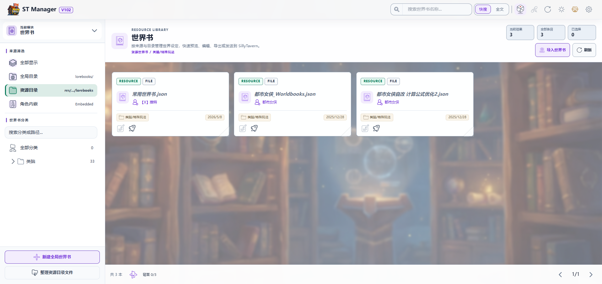
</p>

世界书列表区分全局目录、角色卡资源目录和角色卡内嵌世界书。可以按来源、分类、递归目录、名称和内容筛选，查看条目数量、来源路径、修改时间，并直接进入详情或编辑器。

#### 6. 世界书编辑器与阅览

<p align="center">
  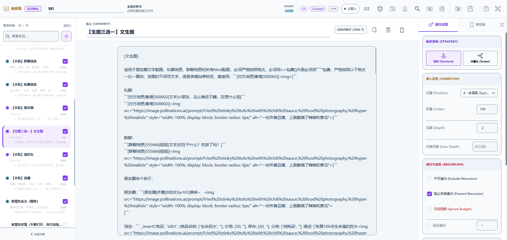
</p>

- 编辑条目备注、关键词、内容、策略、插入位置、顺序和递归设置。
- 管理启用状态、概率、Token 计数、深度和高级逻辑。
- 支持条目搜索、预览、历史版本、剪贴板、重排和批量处理。
- 独立世界书可以保存、导出、迁移和发送到 SillyTavern；内嵌世界书保留与角色卡的绑定关系。

#### 7. 聊天记录管理

<p align="center">
  
</p>

聊天工作区读取 JSONL 对话文件，按已绑定角色卡、未绑定记录和目录组织内容。列表显示消息数量、起止楼层、导入时间和角色信息，支持导入、搜索、修改元数据、绑定角色卡和移入回收站。

#### 8. 聊天阅读器

<p align="center">
  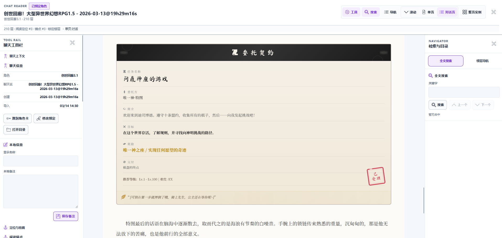
</p>

阅读器提供楼层导航、搜索、书签、锁定阅读位置、分页加载、前后页切换、实例/编辑入口和本地备注。对带有自定义 HTML/CSS 的聊天内容，会在隔离的阅读区域中呈现，便于长对话回看。

#### 9. 预设浏览

<p align="center">
  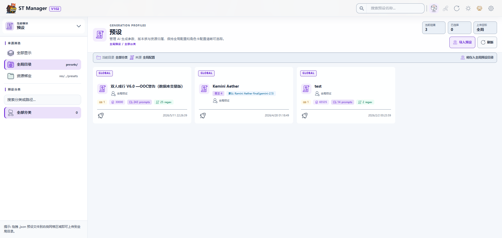
</p>

预设列表展示预设来源、版本、Token 上限、提示词数量和 Regex 数量，支持全局预设、资源绑定预设、分类文件夹、上传、移动、重置、导出以及发送到 SillyTavern。

#### 10. 预设编辑器

<p align="center">
  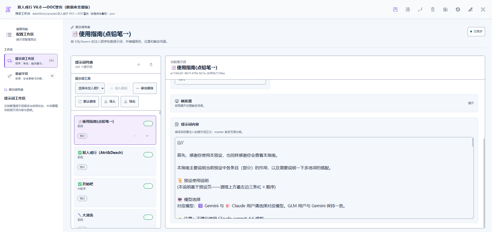
</p>

编辑器支持采样参数、模板、提示词上下文序列、系统消息、Chat Examples、Chat History、World Info 前后插入、开关状态和高级脚本等内容。修改可以保存为预设版本，并配合快照、版本导入、合并和默认版本管理。

#### 11. Beautify 美化包与主题

<p align="center">
  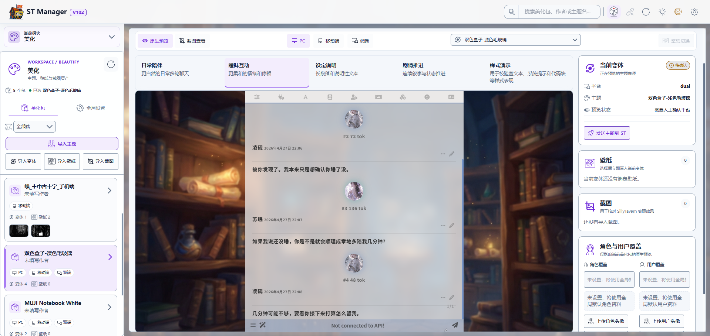
</p>

Beautify 工作区用于管理主题包的身份信息、包头像、PC/移动端变体、主题设置、局部壁纸、全局壁纸、全局头像和截图。每个包可以独立预览资源，修改后再发送到 SillyTavern，避免直接覆盖原始主题文件。

#### 12. 高级扩展：Regex 与 ST Helper

<p align="center">
  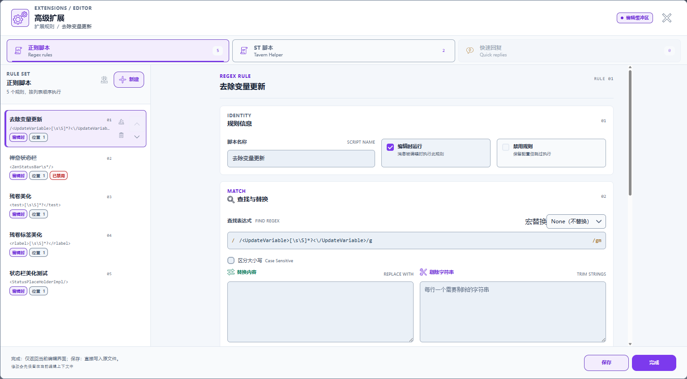
</p>

高级扩展编辑器包含 Regex 和 ST Helper 两类脚本，支持查找、替换、删除字符串、大小写、转义模式、作用位置、深度限制、启用开关和实时测试 playground。ST Helper 脚本同步会读取 JS-Slash-Runner 写入 ST `settings.json` 的全局脚本树，保留脚本文件夹、按钮、变量和导出选项，并导出为可再次导入插件的 JSON。

#### 13. 自动化规则工作台

<p align="center">
  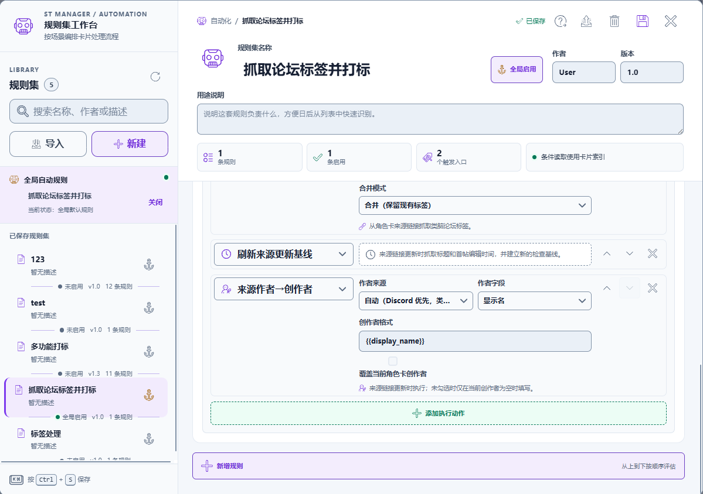
</p>

- 以 IF/THEN 方式组合条件组和动作。
- 条件支持 OR/AND、包含/不包含、多值匹配以及角色卡、世界书、脚本等目标字段。
- 动作支持添加、删除、重命名标签及其他批量资源操作。
- 支持规则集、全局规则、执行预览、规则导入导出和目标选择。

#### 14. 系统设置

<p align="center">
  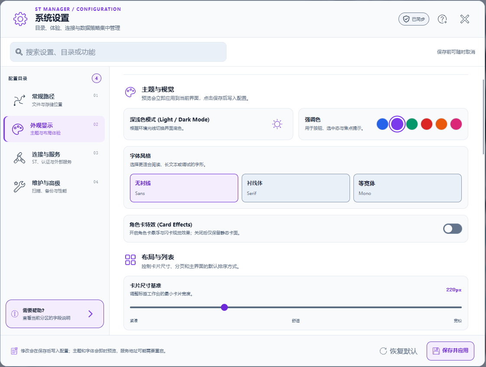
</p>

设置页覆盖常规路径、主题与视觉、连接与服务、维护与高级四类内容，包括角色卡/世界书/聊天/预设目录、SillyTavern 地址和认证、代理、深色模式、强调色、字体、卡片尺寸、壁纸、分页、自动保存、自动扫描和索引开关。

### 移动端

#### 1. 工作区总览与资源导航

<p align="center">
  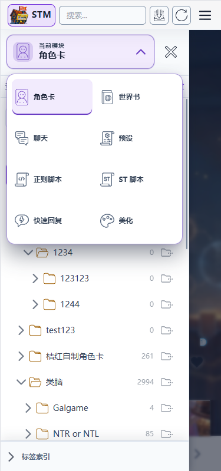
</p>

移动端将工作区标签、搜索、导入和侧边栏折叠到窄屏顶部，侧边栏展开后仍可在角色卡、世界书、聊天、预设、Regex 和 ST 脚本之间切换。

#### 2. 角色卡列表

<p align="center">
  
</p>

角色卡列表保留搜索、收藏、分页、卡片网格和快速编辑入口，并通过两列卡片布局适配手机宽度。

#### 3. 角色卡详情页与编辑工作台

<p align="center">
  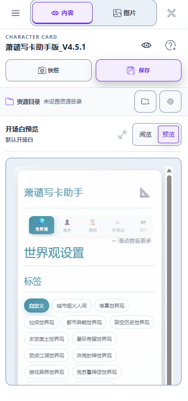
</p>

详情页将图片工具栏、面板导航、本地备注、描述和其他字段纵向排列；图片缩放、保存、标签、世界书、聊天、管理和资源入口仍然与 PC 端保持对应。

#### 4. 搜索、筛选与标签工作台

<p align="center">
  
</p>

<p align="center">
  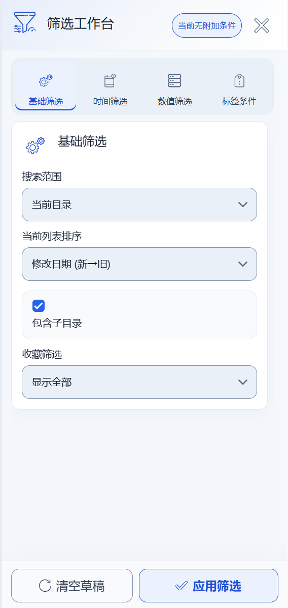
</p>

移动端会把桌面端的顶部筛选控件收纳为抽屉或弹层，保留搜索范围、标签包含/排除、收藏、Token 和日期筛选；标签编辑、颜色和批量操作在窄屏下改为纵向表单。

#### 5. 世界书浏览

<p align="center">
  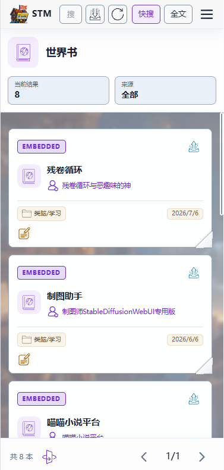
</p>

移动端世界书浏览保留全局、资源绑定和内嵌来源切换，列表卡片显示名称、来源和更新时间，详情入口进入同一世界书阅读/编辑工作流。

#### 6. 世界书编辑器与阅览

<p align="center">
  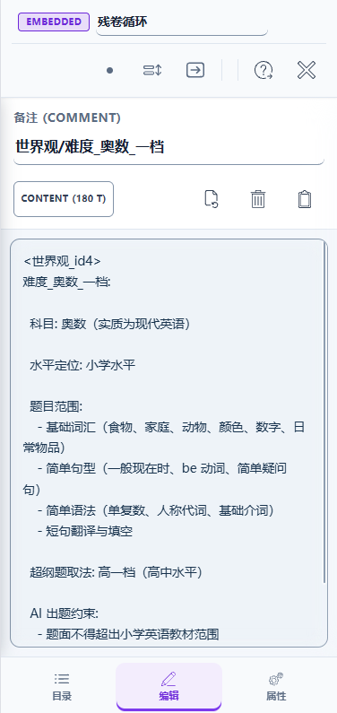
</p>

编辑器将条目内容、关键词、策略、递归和高级设置组织为可滚动区域，并保留保存、导出、历史、剪贴板、条目搜索和前后条目导航。

#### 7. 聊天记录管理

<p align="center">
  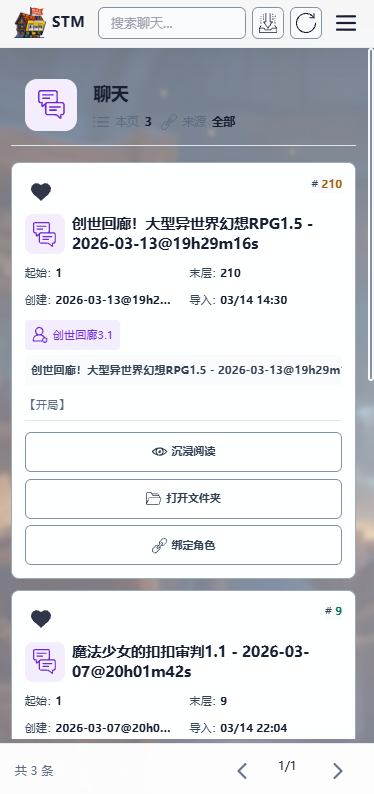
</p>

移动端聊天列表沿用已绑定/未绑定分类、消息数量、导入和搜索能力；较宽的元数据显示为可折叠详情，避免占用列表主区域。

#### 8. 聊天阅读器

<p align="center">
  
</p>

阅读器在手机上将工具、搜索、导航、整页实例和阅读模式集中到顶部操作区，楼层分页和锁定阅读位置独立呈现，正文区域保持连续滚动。

#### 9. 预设浏览

<p align="center">
  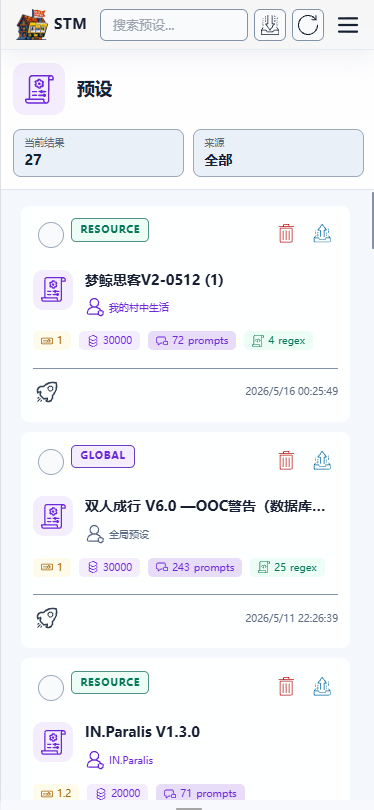
</p>

移动端预设浏览保留预设来源、版本、Token、提示词和 Regex 统计，并将分类、上传、导出和发送到 ST 收纳到顶部菜单或抽屉。

#### 10. 预设编辑器

<p align="center">
  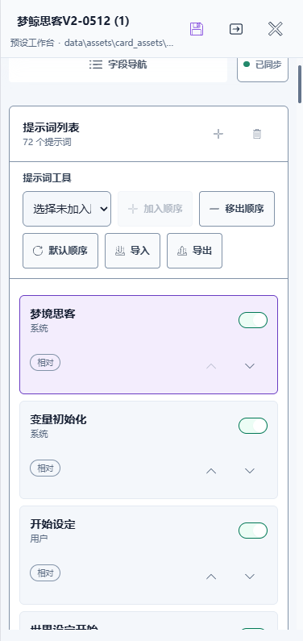
</p>

预设编辑器在移动端将采样参数、提示词块、系统消息和脚本区块纵向排列，提示词开关、排序、版本保存和恢复功能保持与 PC 端一致。

#### 11. Beautify 美化包与主题

<p align="center">
  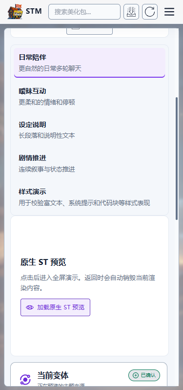
</p>

移动端 Beautify 工作区重点呈现移动端变体、壁纸、头像、主题设置和预览结果；PC/移动端变体仍由同一个主题包统一管理。

#### 12. 高级扩展：Regex 与 ST Helper

<p align="center">
  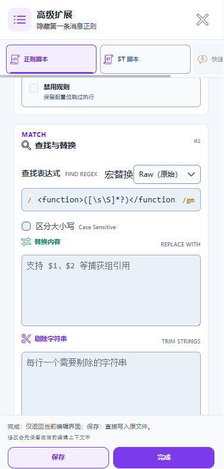
</p>

脚本编辑器在手机上将查找、替换、删除、作用位置、深度和 playground 改为纵向布局，保存和完成操作固定在易于触达的位置。

#### 13. 自动化规则工作台

<p align="center">
  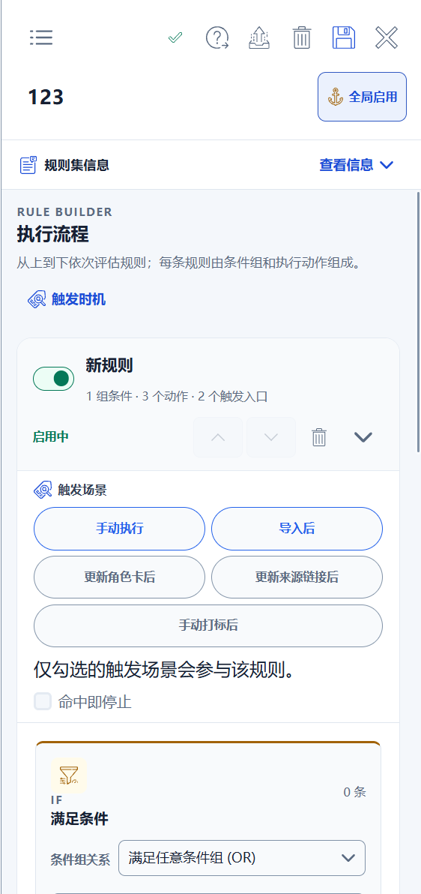
</p>

移动端规则编辑器将规则集列表、条件组和 THEN 动作拆分为可折叠区块，保留规则启用、排序、全局规则、执行和导入导出。

#### 14. 系统设置

<p align="center">
  
</p>

设置页在手机上使用图标侧栏和纵向表单，仍覆盖主题、字体、卡片尺寸、分页、壁纸、路径、连接、扫描、索引和保存应用。

## 技术特点

- 后端：Python 3.10+、Flask、SQLite。
- 文件处理：Pillow、requests、watchdog。
- 前端：服务端模板、Alpine.js、ES modules、Tailwind CSS，以及本地 Markdown/HTML 清理和差异查看库。
- 数据策略：资源文件保存在可配置目录，SQLite 保存元数据、索引和 UI 关联数据；写入操作配合重试、WAL 和路径边界检查。
- 部署方式：本地 Python、Docker Compose，桌面端通过 PyInstaller 工作流构建。

## 快速开始

### 本地 Python

```bash
python -m venv .venv

# Windows PowerShell
.\\.venv\\Scripts\\Activate.ps1

# macOS / Linux
# source .venv/bin/activate

pip install -r requirements.txt
python app.py
```

默认访问地址是 `http://127.0.0.1:5000`。首次启动会生成 `config.json` 使用的运行目录和 `data/system/db/cards_metadata.db`。配置文件与运行数据不应提交到公开仓库。

可以通过命令行覆盖监听参数：

```bash
python app.py --host 127.0.0.1 --port 5000
python app.py --debug
```

### Docker Compose

```bash
docker compose up --build
```

Compose 将 `./data` 挂载到容器的 `/app/data`，将 `./config.json` 挂载到 `/app/config.json`，服务默认暴露在 `http://127.0.0.1:5000`。

## 文档

- [API 参考](docs/API.md)：业务接口、请求方式、参数和文件资源端点。
- [配置参考](docs/CONFIG.md)：`config.json` 全部配置项、默认值与安全注意事项。
- [开发指南](docs/DEVELOPMENT.md)：项目结构、启动链路、测试、CSS 构建和打包。
- [SVG 图标系统](docs/svg-icon-system.md)：网页模板图标精灵的组织与使用约定。

## 许可证

项目代码按 [GNU AGPL-3.0](LICENSE) 发布。仓库中的 SillyTavern vendored 资源、`cards-css` 和前端库保留各自的上游许可与版权声明；分发时请同时遵守对应目录中的 notice 文件。
