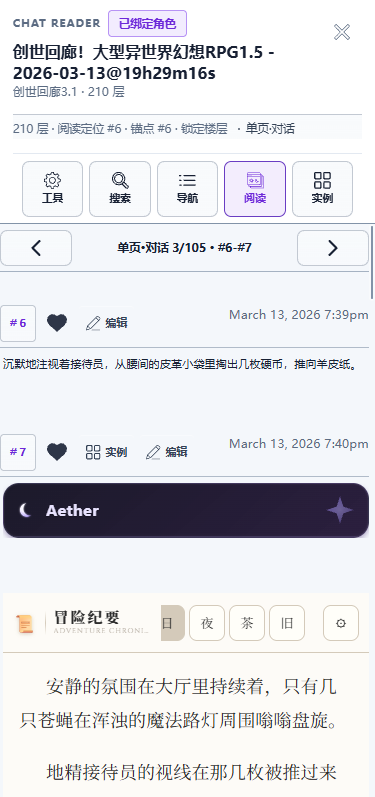
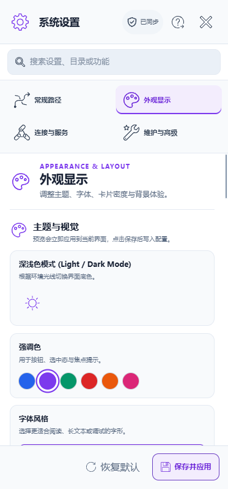

# ST-Manager

<div align="center">

**面向 SillyTavern 的本地资源管理与同步工具**

[](https://www.python.org/downloads/)
[](https://flask.palletsprojects.com/)
[](https://www.sqlite.org/)
[](https://docs.docker.com/compose/)

角色卡、聊天记录、世界书、预设、扩展脚本、主题美化和自动化规则的一站式管理面板。

</div>

<p align="center">
  
</p>


---

## 项目定位

ST-Manager 是一个本地优先的 SillyTavern 资源管理器。它通过 Flask 提供 Web 管理界面，用 SQLite 建立索引与本地元数据层，配合文件系统监听把角色卡、世界书、聊天记录、预设和扩展脚本统一整理到一个可搜索、可编辑、可同步的工作台里。

适合这些场景：

- 本地资源很多，需要按目录、标签、收藏、来源和时间快速筛选
- 想在浏览器里编辑角色卡、世界书、预设和扩展脚本
- 需要把本地资源和 SillyTavern 之间做导入、同步或发送
- 想对资源做批量标签治理、分类整理、自动化命名和规则处理
- 希望在桌面端和移动端都能管理自己的 ST 资源库

---

## 功能概览

| 模块 | 能力 |
| --- | --- |
| 角色卡管理 | 浏览 PNG / JSON 角色卡，查看详情，编辑元数据，替换头像，管理 Bundle 多版本、来源链接、本地备注和资源目录，支持批量导入、删除、移动、收藏与标签处理 |
| 聊天记录 | 导入 `.jsonl` 聊天，绑定角色，全文搜索，收藏楼层，分段读取，沉浸式阅读与保存；支持楼层编辑、批量拖拽导入和正则 / 预设规则合并 |
| 世界书 | 管理全局、资源目录和角色内嵌世界书，支持分类、搜索、编辑、导出、发送到 ST、条目历史，以及与 SillyTavern 对齐的排序和持久化 |
| 预设 | 上传、分类、编辑、导出、发送预设到 ST，支持版本家族、默认版本和扩展字段维护 |
| 扩展脚本 | 统一管理 Regex、Tavern Helper 脚本和 Quick Replies，支持全局目录与资源绑定目录 |
| 自动化规则 | 通过规则集批量执行标签、重命名、分类、模板、论坛标签抓取和来源更新基线刷新等操作 |
| 美化库 | 管理 SillyTavern 主题 JSON、壁纸、头像、截图与变体，支持 PC / 移动端预览和发送到 ST |
| ST 同步 | 检测 ST 连接和数据目录，列出角色、聊天、世界书、预设、Regex、Quick Replies 并同步到本地 |
| 来源联动 | 通过 Discord / 类脑来源链接查看帖子预览，检查来源标题和首帖编辑时间是否更新 |
| 系统工具 | 自动扫描、手动重建索引、快照备份、回收站、共享壁纸、剪贴板分流导入、外网访问认证和路径安全检查 |

---

## 核心特色

### 本地资源可视化

- 多资源类型共用一套浏览、搜索、分类与详情查看体验
- 角色卡支持名称、文件名、标签、作者、Token、导入时间、修改时间等维度筛选
- 角色资源目录支持子目录遍历、皮肤画廊、Regex / 预设 / 其他资源分类和资源删除
- 世界书、预设、扩展脚本可区分全局目录、资源目录和内嵌来源
- 缩略图、背景图、笔记图片和角色资源目录通过资源服务统一访问

### 和 SillyTavern 深度联动

- 支持配置 ST Web 地址和 ST 数据目录
- 支持 Basic / Web 登录等 ST 认证字段归一化
- 可从 ST 侧列出并同步角色、聊天、世界书、预设、Regex 和 Quick Replies
- 可把角色卡、世界书、预设和主题美化包发送回 SillyTavern
- Docker 场景内置 `host.docker.internal`，便于容器访问宿主机 ST 服务

### 类脑来源与更新检查

- 角色卡填写可解析的 Discord `channels` 来源链接后，可从卡片操作区打开「类脑搜索」帖子只读预览
- 预览展示帖子标题、作者、时间、标签、回复 / 反应 / 浏览统计、简介和多图轮播，不会直接修改本地卡片
- 卡片列表和详情页都可以检查来源更新，对比来源标题与首帖编辑时间，并保存本地检查状态
- 第一次检查会建立来源基线；如果来源首帖晚于本地卡片会直接提示首次更新，后续检查可区分标题变化、首帖内容更新、两者同时变化和未变化
- 自动化规则支持论坛标签抓取与「刷新来源更新基线」，角色卡实际更新后也可同步刷新来源标题和基线

类脑帖子预览使用独立的 `shimmerday_forum_cookie`；来源更新检查和论坛标签抓取使用 Discord Token 或 Cookie。凭据配置和来源链接要求见[配置速览](#配置速览)与 [docs/CONFIG.md](docs/CONFIG.md)。

### 角色详情与聊天工作台

- 角色详情页将人格设定、作者注释、系统提示词和后历史指令拆分为可编辑、可隐藏和可预览的字段
- 默认开场白和备用开场白支持切换、编辑、Markdown 预览、增加、删除和拖拽排序，对话示例可单独查看
- 本地备注支持 Markdown 预览和粘贴图片；角色资源可通过皮肤、Regex、预设和其他资源面板统一管理
- 聊天阅读器支持楼层导航、收藏、编辑、批量查找替换、显示规则预览，以及从系统选择并合并 Regex / 预设规则
- 在非编辑输入控件中粘贴文件或 URL 时，会自动识别并分流到角色卡、世界书、预设、聊天或扩展导入流程

### 高效索引与文件监听

- 启动时自动初始化 SQLite、执行索引升级恢复、加载缓存
- `watchdog` 监听文件系统变化，让资源改动同步到数据库
- 支持手动扫描、索引重建、角色卡索引和世界书索引开关
- 大资源库场景下可通过分页、窗口化渲染和索引查询减轻前端压力

### 批量处理与自动化

- 批量上传使用暂存和提交两阶段流程，便于处理冲突
- 支持批量打标签、删标签、标签合并预览和标签分类体系
- 自动化规则集支持导入、导出、全局默认设置和手动执行
- 可将文件命名、分类、标签拆分、论坛标签同步、来源基线刷新等流程固化为规则

### 移动端可用

- 侧边栏在移动端切换为抽屉式导航
- 角色卡、聊天、世界书、设置等核心页面都有移动端适配
- 触控场景保留分类、搜索、详情、编辑和常用批量操作入口

---

## 截图

### 主功能展示

| 角色卡 | 聊天阅读 |
| --- | --- |
|  |  |

| 世界书 | 预设 |
| --- | --- |
|  |  |

| 自动化 | 扩展脚本 |
| --- | --- |
|  |  |

### 更多界面

| 角色详情 | 世界书编辑 | 设置 |
| --- | --- | --- |
|  |  |  |

| 移动端角色卡 | 移动端聊天 | 移动端设置 |
| --- | --- | --- |
|  |  |  |

### 新增能力展示

| 类脑帖子预览 | 来源更新检查 |
| --- | --- |
|  |  |

| 角色详情编辑 | 世界书排序 |
| --- | --- |
|  |  |

---

## 快速开始

### 环境要求

- Python 3.10+
- pip
- 可选：SillyTavern 本体，用于同步和发送资源

### 本地运行

```bash
git clone https://github.com/Dadihu123/ST-Manager.git
cd ST-Manager
pip install -r requirements.txt
python app.py
```

默认访问地址：

```text
http://127.0.0.1:5000
```

首次启动时，如果项目根目录没有 `config.json`，程序会自动生成默认配置，并创建运行所需的数据目录。

### 指定监听地址和端口

```bash
python app.py --host 127.0.0.1 --port 5000
```

命令行参数只影响当前进程，不会写回 `config.json`。

### 调试模式

```bash
python app.py --debug
```

或：

```bash
FLASK_DEBUG=1 python app.py
```

调试模式会启用 Flask reloader。项目已避免在 reloader watcher 进程里重复启动后台扫描器和索引 worker。

---

## Docker 部署

项目内置 `Dockerfile` 和 `docker-compose.yaml`。

```bash
docker-compose up -d
```

访问：

```text
http://localhost:5000
```

Compose 部署包含两个服务：

| 服务 | 作用 |
| --- | --- |
| `init-config` | 首次启动前在宿主机项目根目录生成 `./config.json` |
| `st-manager` | 启动主 Web 服务，暴露 `5000` 端口 |

默认挂载：

| 宿主机路径 | 容器路径 | 说明 |
| --- | --- | --- |
| `./data` | `/app/data` | 运行时数据、数据库、缩略图、资源库 |
| `./config.json` | `/app/config.json` | 主配置文件 |

Docker 首次生成配置时会把 `host` 设为 `0.0.0.0`，便于容器对外监听。如果容器内需要访问宿主机上的 SillyTavern，可优先把 `st_url` 配成类似：

```json
{
  "st_url": "http://host.docker.internal:8000"
}
```

---

## 桌面版构建

仓库提供 GitHub Actions 桌面打包工作流，可构建以下交付件：

- Windows 可执行文件
- macOS `arm64` 和 `x86_64` 应用压缩包

工作流会在推送到 `main`、推送 `v*` 标签或手动触发时运行，构建产物可在 GitHub Actions 对应运行记录的 Artifacts 中下载。

---

## 配置速览

主要配置文件：

```text
config.json
```

常用字段：

| 配置项 | 默认值 | 说明 |
| --- | --- | --- |
| `host` | `127.0.0.1` | Web 服务监听地址 |
| `port` | `5000` | Web 服务监听端口 |
| `cards_dir` | `data/library/characters` | 角色卡目录 |
| `world_info_dir` | `data/library/lorebooks` | 世界书目录 |
| `chats_dir` | `data/library/chats` | 聊天目录 |
| `presets_dir` | `data/library/presets` | 预设目录 |
| `regex_dir` | `data/library/extensions/regex` | Regex 目录 |
| `scripts_dir` | `data/library/extensions/tavern_helper` | Tavern Helper 脚本目录 |
| `quick_replies_dir` | `data/library/extensions/quick-replies` | Quick Replies 目录 |
| `beautify_dir` | `data/library/beautify` | 美化包目录 |
| `resources_dir` | `data/assets/card_assets` | 角色资源目录 |
| `st_url` | `http://127.0.0.1:8000` | SillyTavern Web 地址 |
| `st_data_dir` | `""` | SillyTavern 数据目录，留空时尝试自动探测 |
| `discord_auth_type` | `token` | Discord 来源更新检查和论坛标签抓取的认证方式，可选 `token` / `cookie` |
| `discord_bot_token` | `""` | Discord Token 凭据，使用 Token 认证时填写 |
| `discord_user_cookie` | `""` | Discord 浏览器 Cookie，使用 Cookie 认证时填写 |
| `shimmerday_forum_cookie` | `""` | 类脑搜索站帖子预览使用的会话 Cookie |
| `sync_source_title_on_update` | `true` | 角色卡实际更新后是否同步来源标题并刷新首帖更新基线 |
| `enable_auto_scan` | `true` | 是否启用文件系统监听 |
| `auth_username` / `auth_password` | `""` | 设置后启用外网访问登录保护 |

更完整的配置说明见 [docs/CONFIG.md](docs/CONFIG.md)。

### 类脑与来源功能配置

1. 在角色卡详情页填写 Discord `channels` 来源链接，类脑预览和来源更新按钮才会出现。
2. 要使用类脑帖子预览，在设置中填写 `shimmerday_forum_cookie`。可登录类脑搜索站，在浏览器开发者工具的 Network 面板复制请求 Cookie。
3. 要使用来源更新检查或论坛标签抓取，配置 `discord_auth_type` 对应的 Token 或 Cookie；凭据属于敏感信息，不要提交到版本库。
4. 来源链接变更后会清除旧基线；首次成功检查通常建立基线，若来源首帖晚于本地卡片会直接提示首次更新，后续检查再判断来源是否变化。

---

## 公网访问建议

如果需要通过局域网、内网穿透或公网访问 ST-Manager，建议至少完成以下配置：

1. 设置 `auth_username` 和 `auth_password`，或使用环境变量 `STM_AUTH_USER` / `STM_AUTH_PASS`
2. 如有反向代理，配置 `auth_trusted_proxies`
3. 如需免登录访问固定来源，配置 `auth_trusted_ips`
4. 确认 `host` 监听地址符合部署场景，本地只用建议保留 `127.0.0.1`

认证模块包含白名单、失败限流、临时锁定和硬锁定逻辑。详细规则见 [docs/CONFIG.md](docs/CONFIG.md#4-外网访问认证)。

---

## 项目结构

```text
ST-Manager/
├── app.py                    # 启动入口
├── .github/workflows/        # Docker 与桌面版构建工作流
├── core/
│   ├── __init__.py           # create_app + init_services
│   ├── api/v1/               # REST API 蓝图
│   ├── services/             # 业务服务、索引、同步、版本逻辑
│   ├── automation/           # 自动化规则引擎
│   ├── data/                 # SQLite、缓存、聊天存储、索引状态
│   └── utils/                # 文件、图片、文本、路径等工具
├── templates/                # Jinja2 页面和组件模板
├── static/                   # 前端 JS、CSS、图片和本地 vendor 资源
├── docs/                     # 配置、API、开发文档与截图占位
├── tests/                    # pytest 与前端契约回归测试
├── Dockerfile
└── docker-compose.yaml
```

---

## 开发与验证

安装测试工具：

```bash
pip install pytest
```

运行测试：

```bash
pytest tests/
```

运行单个测试文件：

```bash
pytest tests/test_st_auth_flow.py
```

项目还包含若干前端契约和模板回归测试，用于保护聊天阅读器、世界书、预设、美化库、自动化规则等复杂界面行为。

---

## 相关文档

| 文档 | 内容 |
| --- | --- |
| [docs/CONFIG.md](docs/CONFIG.md) | 配置生成、默认值、认证、Docker 和排查建议 |
| [docs/API.md](docs/API.md) | REST API 汇总，覆盖各资源模块和系统接口 |
| [docs/DEVELOPMENT.md](docs/DEVELOPMENT.md) | 启动链路、架构分层、目录结构和开发约定 |

---

## 反馈与贡献

欢迎通过 Issue 反馈问题或提出建议：

- [GitHub Issues](https://github.com/Dadihu123/ST-Manager/issues)
- [Discord 讨论帖](https://discord.com/channels/1134557553011998840/1448353646596325578)

贡献流程：

1. Fork 仓库
2. 创建功能分支
3. 提交改动
4. 发起 Pull Request

---

## 许可证

许可证信息待补充。正式对外开源前，建议添加独立的 `LICENSE` 文件，并在这里写明具体许可证。

---

<div align="center">

如果这个项目对你有帮助，欢迎给一个 Star。

</div>
